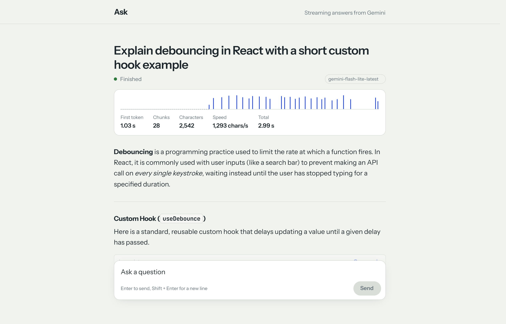
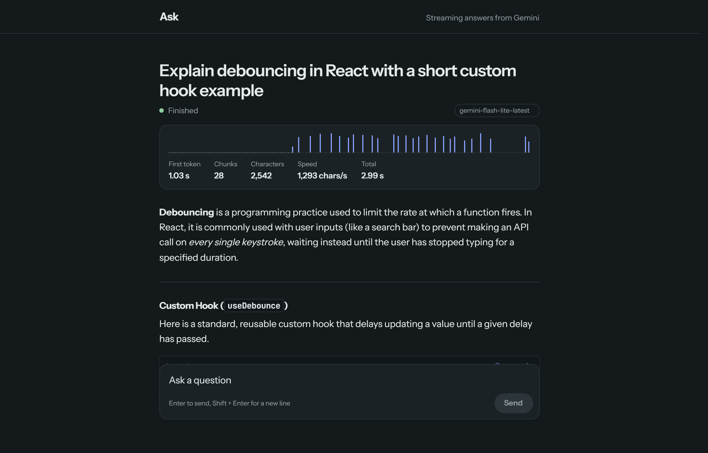
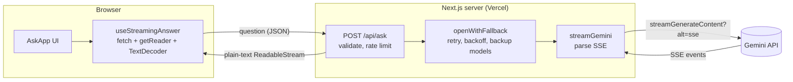
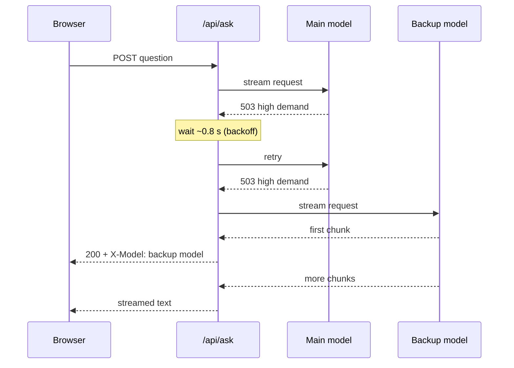

# Ask: streaming LLM answers

Ask a question and watch the answer stream in token by token, the way ChatGPT and Claude do.
Built by hand with **Next.js 16, React 19 and TypeScript** on Google's **Gemini** API, with no AI SDK
hiding the streaming.

[](https://nextjs.org)
[](https://react.dev)
[](https://www.typescriptlang.org)
[](https://ai.google.dev)
[](https://prasad-ask-stream.vercel.app/)

**[Live demo](https://prasad-ask-stream.vercel.app/)** &nbsp;|&nbsp;
**[Source code](https://github.com/prasad-k-s/ask-stream)** &nbsp;|&nbsp;
**[Author portfolio](https://prasad-sankar.vercel.app)**



<details>
<summary><b>Dark mode</b></summary>
<br>



</details>

---

## Contents

- [Why I built this](#why-i-built-this)
- [Features](#features)
- [How it works](#how-it-works)
- [Tech stack](#tech-stack)
- [Run it locally](#run-it-locally)
- [Environment variables](#environment-variables)
- [Try every state with mock mode](#try-every-state-with-mock-mode)
- [Deploy to Vercel](#deploy-to-vercel)
- [Project structure](#project-structure)
- [Implementation notes](#implementation-notes)
- [What I'd add next](#what-id-add-next)

## Why I built this

Most chat demos use a library hook like `useChat`, which hides the interesting parts. I wanted to
show I can handle the full streaming path myself: reading a network stream in the browser, parsing
Server-Sent Events on the server, cancelling requests, and recovering from the errors real LLM APIs
throw at you.

## Features

**Streaming**
- Answers appear token by token with a blinking caret
- **Stream timeline** under every answer: each network chunk is drawn as a tick at the moment it
  arrived, with time to first token, chunk count, characters per second and total time
- Incoming chunks are batched into one React render per animation frame, so fast streams stay smooth

**Control**
- **Stop** button (or `Esc`) cancels with `AbortController`, and the server cancels the Gemini request
  too, so no tokens are wasted
- Asking a new question cancels the previous one, so answers never interleave
- Clear states: waiting for first token, streaming, finished, stopped, failed

**Resilience**
- **Automatic retry and backup models**: if Gemini says the model is busy, the server retries with
  exponential backoff, then switches to a backup model. The UI shows which model answered.
- Friendly, specific errors: invalid key, model busy, quota used up, rate limited, network down,
  answer cut off mid-stream
- **Retry** button with a countdown that respects the server's `Retry-After` header

**Reading experience**
- Markdown that renders correctly while still half-written: headings, lists, tables, and
  syntax-highlighted code blocks with **Copy code**
- Smart auto-scroll that stops following when you scroll up, plus **Jump to latest**
- Enter to send, Shift + Enter for a new line, IME-safe, auto-growing input
- Light and dark mode, visible keyboard focus, `prefers-reduced-motion` respected, works on mobile

**Security**
- The API key lives only on the server and is sent in a header, never in a URL or the browser
- Input validation and a per-IP rate limit (10 requests per minute) protect the key from abuse

## How it works



1. The browser POSTs the question to `/api/ask`.
2. The route validates it, applies the rate limit, and opens a streaming request to Gemini.
3. **The route waits for the first chunk before replying.** That lets it return a real HTTP status
   (401, 429, 503) for errors, and gives it a window to retry or switch models before the user sees
   anything.
4. Gemini's Server-Sent Events are parsed and re-sent to the browser as plain text through a
   `ReadableStream`.
5. The browser reads the body with `getReader()`, decodes it with `TextDecoder`, and appends it to the
   answer.

### Retry and fallback flow



| Upstream result | What the server does |
| --- | --- |
| Model busy (500 / 503 / "high demand") | Retry the same model once with backoff, then move to the next model |
| Quota used up (429) | Skip straight to the next model (each model has its own free quota) |
| Invalid key, bad request | Fail immediately, retrying can't fix it |
| Every model failed | `503 overloaded` or `429 rate_limited`, with `Retry-After` |
| Fails after text was sent | Stop the stream; the browser shows "the answer was cut off" |

## Tech stack

| Area | Choice |
| --- | --- |
| Framework | Next.js 16 (App Router, Route Handlers) |
| UI | React 19, TypeScript (strict), plain CSS with design tokens |
| Model | Google Gemini via REST `streamGenerateContent` (free tier) |
| Markdown | react-markdown, remark-gfm, rehype-highlight |
| Fonts | Instrument Sans, JetBrains Mono (via `next/font`) |
| Hosting | Vercel |

## Run it locally

**Prerequisites:** Node.js 20.9 or newer, and a free Gemini API key from
[Google AI Studio](https://aistudio.google.com/apikey) (no credit card needed).

```bash
git clone https://github.com/prasad-k-s/ask-stream.git
cd ask-stream
npm install
```

Create your env file from the template:

```bash
# macOS / Linux / Git Bash
cp .env.example .env.local

# Windows PowerShell
Copy-Item .env.example .env.local
```

Open `.env.local`, paste your key after `GEMINI_API_KEY=`, then start the dev server:

```bash
npm run dev
```

Open http://localhost:3000.

> Restart `npm run dev` after editing `.env.local`. Next.js only reads it at startup.

**Check that your key works** (lists the models it can use, uses no quota):

```powershell
# PowerShell
Invoke-RestMethod "https://generativelanguage.googleapis.com/v1beta/models" -Headers @{ "x-goog-api-key" = "YOUR_KEY" } | Select-Object -ExpandProperty models | Select-Object -ExpandProperty name
```

```bash
# macOS / Linux
curl -s -H "x-goog-api-key: YOUR_KEY" https://generativelanguage.googleapis.com/v1beta/models | grep '"name"'
```

### Scripts

| Command | What it does |
| --- | --- |
| `npm run dev` | Start the dev server on port 3000 |
| `npm run build` | Production build |
| `npm start` | Run the production build |
| `npm run typecheck` | Type-check with `tsc --noEmit` |

## Environment variables

| Name | Required | Default | Description |
| --- | --- | --- | --- |
| `GEMINI_API_KEY` | Yes | | Your Gemini key, or `mock` for the fake model |
| `GEMINI_MODEL` | No | `gemini-flash-latest` | Main model |
| `GEMINI_FALLBACK_MODELS` | No | `gemini-flash-lite-latest,gemini-2.5-flash` | Backup models, comma-separated, tried in order |

`.env.local` is in `.gitignore`, so your key is never committed.

## Try every state with mock mode

Set `GEMINI_API_KEY=mock` to use a built-in fake model. It streams a sample answer, uses no quota, and
works offline, which makes it handy for development and for recording demos. Include these words in
a question to trigger each state:

| Put this in the question | What you'll see |
| --- | --- |
| *(anything)* | A normal streamed answer with code and a table |
| `busy` | Main model busy, answer comes from a backup model |
| `overloaded` | Every model busy: "The model is busy right now" with a Retry countdown |
| `error` | A non-retryable error |

Press **Stop** or `Esc` mid-answer to see the stopped state.

## Deploy to Vercel

1. Push the repo to GitHub.
2. On [vercel.com](https://vercel.com), click **Add New → Project** and import the repo.
3. Under **Environment Variables**, add `GEMINI_API_KEY` (and the optional model settings).
4. Click **Deploy**. Vercel gives you a public URL like the [live demo](https://prasad-ask-stream.vercel.app/).

Every later push to `main` redeploys automatically.

## Project structure

```
app/
  api/ask/route.ts        POST /api/ask: validation, rate limit, fallback, streaming response
  layout.tsx              fonts, metadata
  page.tsx                renders <AskApp />
  globals.css             design tokens (light and dark) and all styles
components/
  AskApp.tsx              page layout and state wiring
  Composer.tsx            input box with Send / Stop
  Markdown.tsx            streaming-safe Markdown and code blocks
  StreamTimeline.tsx      chunk timeline and stats
  ErrorNotice.tsx         error messages, Retry with countdown
hooks/
  useStreamingAnswer.ts   fetch, stream reader, frame batching, abort, typed errors
  useStickToBottom.ts     smart auto-scroll
lib/
  gemini.ts               Gemini REST call and SSE parser
  fallback.ts             retry with backoff and backup models
  mock.ts                 fake streaming model for development
  rate-limit.ts           in-memory per-IP rate limiter
  types.ts                shared error codes and header names
```

## Implementation notes

**Reading the stream in the browser** (`hooks/useStreamingAnswer.ts`)

```ts
const res = await fetch("/api/ask", { method: "POST", body, signal: controller.signal });
const reader = res.body!.getReader();
const decoder = new TextDecoder();

while (true) {
  const { done, value } = await reader.read();
  if (done) break;
  pending += decoder.decode(value, { stream: true }); // stream: true keeps multi-byte chars intact
  scheduleFlush();                                    // one setState per animation frame
}
```

**Parsing Server-Sent Events on the server** (`lib/gemini.ts`). Network chunks don't line up with
SSE events, so text is buffered until a blank line (`\n\n` or `\r\n\r\n`) marks a complete event.

**Why wait for the first chunk?** Once a `200` response starts streaming, its status code can't
change. Waiting for the first chunk means a bad key, quota error or busy model can still be returned
as a proper error, or quietly retried on another model.

**Cancelling end to end.** Stop aborts the browser `fetch`. That aborts `req.signal` on the server,
which aborts the Gemini request, so generation (and quota use) stops too.

**Known limits.** The rate limiter is in memory, so on serverless hosts it resets when an instance
restarts; production traffic would need Redis (for example Upstash). On the free Gemini tier,
Google may use prompts to improve its models, so don't send anything confidential.

## What I'd add next

- Multi-turn chat with conversation history
- Chat history saved in a database
- Model picker in the UI
- Upload a PDF and ask questions about it
- Automated tests with Vitest for the hook and route

## Author

**Prasad** ([@prasad-k-s](https://github.com/prasad-k-s)), frontend developer (React, TypeScript, Next.js)

- Portfolio: [prasad-sankar.vercel.app](https://prasad-sankar.vercel.app)
- GitHub: [@prasad-k-s](https://github.com/prasad-k-s)
